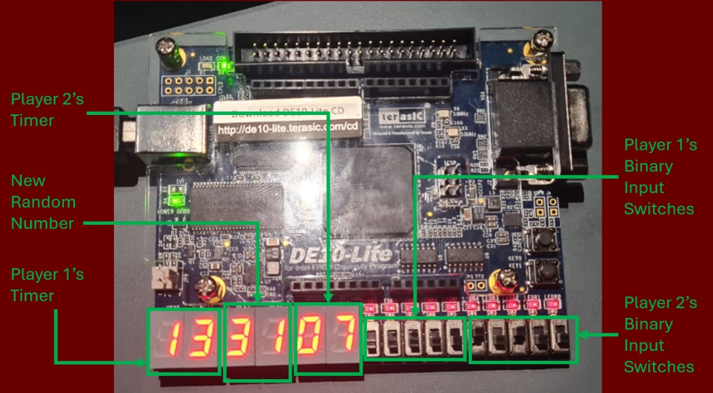
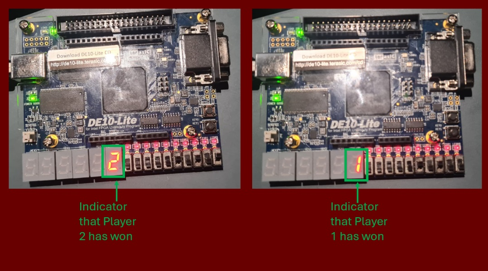

# Beat The Clock Binary

## Project Overview  
**Names:** Yadon Kasshaun & Mohammad Zain Al Syed  

Live demonstration: https://www.youtube.com/watch?v=9dlH2-jN5HA

Beat The Clock Binary is an FPGA-based digital two-player game that combines combinational and sequential logic to create a competitive and timed gameplay experience. Players take turns guessing randomly generated 5-bit binary numbers within a time limit. Real-time score tracking and countdown timers are implemented using XOR gates for input verification, binary adders/subtractors for timer calculations, and a clock divider for precise timing. The game state transitions manage turn changes, score updates, and timer decrements, ensuring smooth gameplay.  

## Technical Details  
The project is implemented in Verilog and features multiple modules, including a random number generator for 5-bit binary values, edge detection for responsive button presses, and 5-bit counters for player timers. A 1 Hz clock signal, derived from a clock divider, controls the countdown timers. The game logic checks active timers, updates random numbers, and resets values as needed. Seven-segment displays are used to show timers and generated numbers, providing real-time feedback to players.  

## Gameplay Description  
At the start, both players' countdown timers are set to 30 seconds and displayed on the FPGA's seven-segment displays. The first player's timer begins counting down, and they must input the displayed 5-bit binary number using switches. If the guess is correct, their timer pauses, and the other player's timer starts. This alternates until one player's timer reaches zero, declaring the other player the winner. The winning player's number is displayed on the final seven-segment display.  

## Key Features  
- Real-time countdown timers and score tracking.  
- Random 5-bit binary number generation.  
- Responsive button and switch inputs with edge detection.  
- Seven-segment displays for timer and number visualization.  
- Combinational and sequential logic integration for seamless gameplay.  

This project demonstrates the effective use of digital design techniques to create an engaging and interactive game, showcasing both technical skill and creativity.

## Running the Program on DE-10 Lite with Quartus  

To run the **Beat The Clock Binary** game on the DE-10 Lite FPGA board using Quartus, follow these steps:  

1. **Open Quartus Prime**: Launch the Quartus Prime software on your computer.  

2. **Create a New Project**:  
   - Go to `File > New Project Wizard`.  
   - Set the project directory and name it (e.g., `BeatTheClockBinary`).  
   - Add the provided Verilog files (`BeatTheClockBinary.v`, `clk_div.v`, `RandomGenerator.v`, `show.v`, `Subtractor58it.v`, and `adder.v`) to the project.  

3. **Set the Top-Level Entity**:  
   - In the Project Navigator, set `BeatTheClockBinary.v` as the top-level entity.  

4. **Assign Pins**:  
   - Open the `Pin Planner` and assign the FPGA pins according to the DE-10 Lite board's specifications. Ensure switches, buttons, and seven-segment displays are correctly mapped.  

5. **Compile the Project**:  
   - Click on `Processing > Start Compilation` to compile the project. Resolve any errors if they occur.  

6. **Program the FPGA**:  
   - Connect the DE-10 Lite board to your computer via USB.  
   - Open the `Programmer` tool in Quartus.  
   - Load the compiled `.sof` file and click `Start` to program the FPGA.  

7. **Play the Game**:  
   - Once programmed, the game will start on the DE-10 Lite board. Use the switches to input binary guesses and observe the timers and results on the seven-segment displays.  

For detailed pin assignments and troubleshooting, refer to the DE-10 Lite user manual and the project documentation. Enjoy the game!
